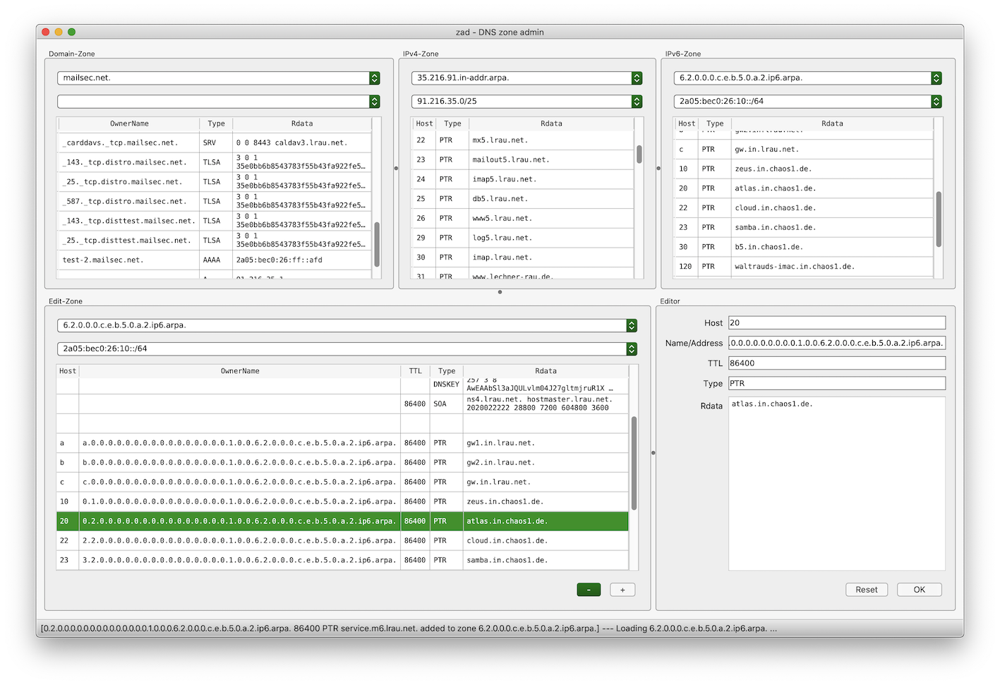

.. _introduction:

.. toctree::

Introduction
============

zad is an OpenSource software tool, written in Python that is intended
to handle the administration of DNS zone data of small zones (< 1000 RRs).
"zad" stands for "zone administration".

Supported features
__________________

Currently zad can:

* starting with a configured domain zone, this and any referenced zones,
  which are reachable,
  are loaded (via AXFR) and displayed via browsable tables.
* delete, add or update resource records of these zones via dynamic update
* check of semantic and syntax of entered resource record if 'OK' or '+' clicked
* to give the user a feedback, the modified zone is re-read and displayed
* the graphical user interface has been designed to allow point and click
* this tries to avoid the requirement to re-enter any data already
  displayed in the tables
* to simplify maintenance of reverse zones (especially of IPv6 ones),
  containing networks can be configured, which allows to enter and modify
  host addresses, relative to the selected network
* if no network has been configured for a reverse zone, default prefixes
  are used
* report any transaction and errors in both the GUI and a logfile
* optionally can display debug information

Features currently worked on
____________________________

* Check button to check current contents of form fields for correctness
  (Currently done after clicking of 'OK' or '+')
* Searching resource sets by owner names
* Allow navigating by cursor keys in table views. (Currently only selecting by mouse
  works)

Motivation
__________

In times of DNSsec, editing zone files by hand (e.g. with bind9 inline-signing)
often interferes with resigning activities of the nameserver.
To avoid inconsistencies, zones can be maintained by dynamic update
(RFC 2136).

This project was started to help the administrator with transition from
maintenance of zones in flat files to maintenance of zones via
dynamic update.

